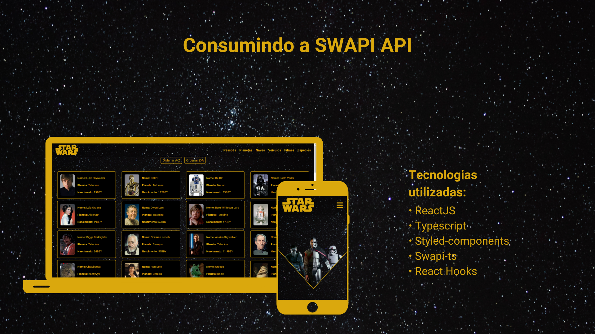

# Consumindo a SWAPI



### Descrição
Um aplicação SPA que consome a SWAPI (Star Wars API).

## Tecnologias utilizadas
- ReactJs
- React Hooks
- Typescript
- Styled Components
- Swapi-ts 

### Como instalar (React)

* Para baixar o projeto siga as instruções abaixo:

```
1. git clone https://github.com/CaioVieira-dev/desafio-swapi.git
2. cd desafio-swapi
```

* Instale as dependências do projeto:

```
3. yarn install
4. yarn start
```

ou

```
3. npm install
4. npm start
```
## Me encontre nas redes sociais
- [Instagram: @caiovieira_dev](https://www.instagram.com/caiovieira_dev/)
- [LinkedIn: Caio Vieira](https://www.linkedin.com/in/caio-vieira-b1aab9201/)

## Licença
Este projeto pode ser usado por qualquer um. Licença MIT.


